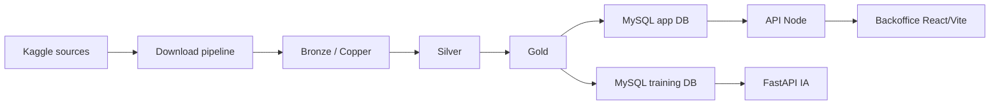

# Flux de données - HealthAI Coach

## Vue d'ensemble

Le projet suit une chaîne data en plusieurs étapes, de l'extraction des jeux de données jusqu'à l'exploitation applicative.

## Étapes du flux

1. Téléchargement des datasets Kaggle avec authentification locale.
2. Normalisation minimale en bronze / copper.
3. Nettoyage et structuration en silver.
4. Consolidation métier en gold.
5. Ingestion dans les bases MySQL dédiées.
6. Exposition des données via l'API Node et la couche IA.
7. Visualisation dans le backoffice web.

