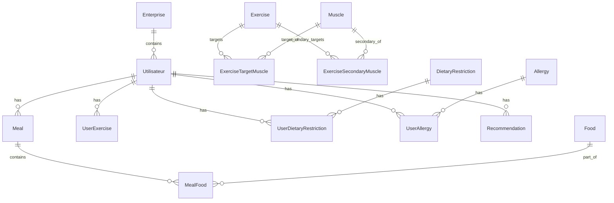

# MCD / MLD / MPD — Modèle de données (HealthAI Coach)

Ce document est la transcription documentaire du schéma source `bdd.prisma`.
Il sert de référence de rendu pour le jury et doit rester cohérent avec la base réelle.

## 1 — MCD (conceptuel)



### Entités métier

- `Utilisateur` : profil applicatif avec données démographiques et variables de suivi santé/activité.
- `Enterprise` : compte entreprise/tenant rattachant plusieurs utilisateurs.
- `Meal` / `Food` / `MealFood` : journal alimentaire et détail des repas.
- `Exercise` / `Muscle` / `ExerciseTargetMuscle` / `ExerciseSecondaryMuscle` : catalogue d’exercices et ciblage musculaire.
- `UserExercise` : séance ou activité enregistrée pour un utilisateur.
- `Recommendation` : recommandation générée et historisée pour un utilisateur.
- `Allergy` et `DietaryRestriction` : référentiels métier, reliés aux utilisateurs via tables d’association.

## 2 — MLD 

Tables relationnelles dérivées du schéma Prisma :

- `Utilisateur`(id PK, nom, age, gender, poids, taille, disease_type, disease_severity, daily_caloric_intake, adherence_to_diet_plan, physical_activity_level, enterprise_id FK nullable, createdAt)
- `Enterprise`(id PK, slug UNIQUE, name, email UNIQUE, passwordHash, sector nullable, createdAt)
- `Meal`(id PK, user_id FK->Utilisateur.id, meal_type, date, total_calories nullable, water_intake nullable)
- `Food`(id PK, name, category, calories, protein, carbohydrates, fat, fiber, sugars, sodium, cholesterol)
- `MealFood`(meal_id FK->Meal.id, food_id FK->Food.id, quantity, PK(meal_id, food_id))
- `Exercise`(id PK, name, equipment nullable, body_part nullable, exercise_type nullable)
- `Muscle`(id PK, name)
- `ExerciseTargetMuscle`(exercise_id FK->Exercise.id, muscle_id FK->Muscle.id, PK(exercise_id, muscle_id))
- `ExerciseSecondaryMuscle`(exercise_id FK->Exercise.id, muscle_id FK->Muscle.id, PK(exercise_id, muscle_id))
- `UserExercise`(id PK, user_id FK->Utilisateur.id, exercise_id FK->Exercise.id, duration, calories_burned nullable, date)
- `Recommendation`(id PK, user_id FK->Utilisateur.id, type, reference_id, score nullable, reason nullable, created_at)
- `DietaryRestriction`(id PK, name)
- `UserDietaryRestriction`(user_id FK->Utilisateur.id, restriction_id FK->DietaryRestriction.id, PK(user_id, restriction_id))
- `Allergy`(id PK, name)
- `UserAllergy`(user_id FK->Utilisateur.id, allergy_id FK->Allergy.id, PK(user_id, allergy_id))
- `Admin`(id PK, email UNIQUE, passwordHash, createdAt)
- `AppSetting`(key PK, value JSON, createdAt, updatedAt)

### Remarques MLD

- Les associations many-to-many sont matérialisées par des tables de jointure avec clé primaire composite.
- Le champ `enterprise_id` sur `Utilisateur` est nullable pour permettre des utilisateurs hors tenant entreprise.
- Le schéma ne contient pas de tables `Plan`, `UserPlan`, `Disease`, `BusinessPartner`, `UserMetric` ou `UserDisease` dans l’état actuel du projet.

## 3 — MPD (physique / MySQL)

### Principes physiques

- Identifiants en `INT AUTO_INCREMENT`.
- Texte en `String` Prisma, donc `VARCHAR` côté MySQL.
- Mesures en `Float` Prisma, donc type numérique flottant côté MySQL.
- Dates en `DATETIME` / `TIMESTAMP` selon le besoin applicatif.
- Métadonnées et paramètres applicatifs stockés dans `AppSetting.value` en JSON.

### Extrait MPD fidèle au schéma

```sql
CREATE TABLE Enterprise (
  id INT AUTO_INCREMENT PRIMARY KEY,
  slug VARCHAR(255) NOT NULL UNIQUE,
  name VARCHAR(255) NOT NULL,
  email VARCHAR(255) NOT NULL UNIQUE,
  passwordHash VARCHAR(255) NOT NULL,
  sector VARCHAR(255) NULL,
  createdAt DATETIME NOT NULL
);

CREATE TABLE Utilisateur (
  id INT AUTO_INCREMENT PRIMARY KEY,
  nom VARCHAR(255) NOT NULL,
  age INT NOT NULL,
  gender VARCHAR(255) NOT NULL,
  poids DOUBLE NOT NULL,
  taille DOUBLE NOT NULL,
  disease_type VARCHAR(255) NULL,
  disease_severity VARCHAR(255) NULL,
  daily_caloric_intake INT NULL,
  adherence_to_diet_plan DOUBLE NULL,
  physical_activity_level VARCHAR(255) NULL,
  enterprise_id INT NULL,
  createdAt DATETIME NOT NULL,
  INDEX enterprise_id_idx (enterprise_id),
  CONSTRAINT fk_utilisateur_enterprise
    FOREIGN KEY (enterprise_id) REFERENCES Enterprise(id)
);

CREATE TABLE AppSetting (
  `key` VARCHAR(255) PRIMARY KEY,
  value JSON NOT NULL,
  createdAt DATETIME NOT NULL,
  updatedAt DATETIME NOT NULL
);
```


## 6 — Livrables associés

- `bdd.prisma` : schéma source de vérité.
- `DOCS/guide_de_deploiement.md` : guide d’exploitation.

